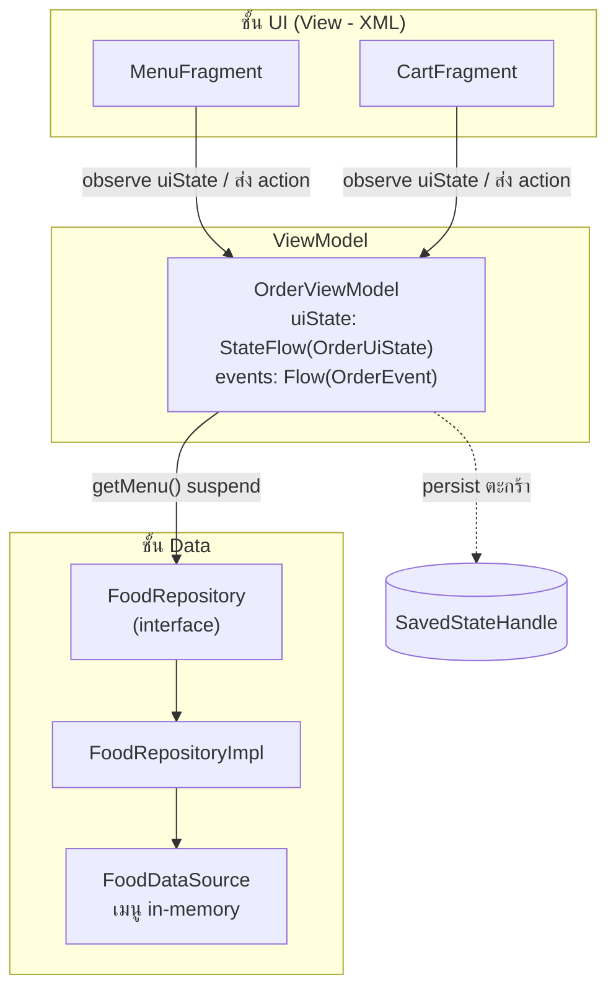
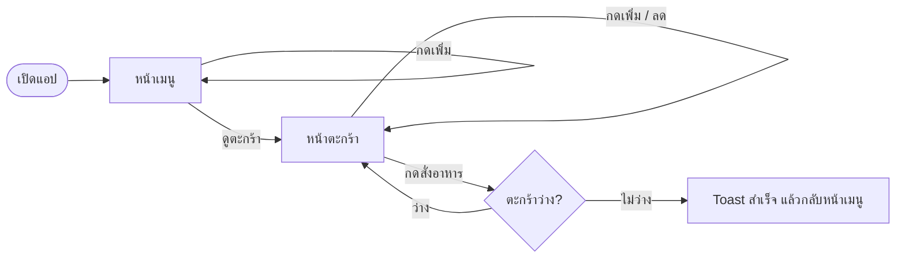
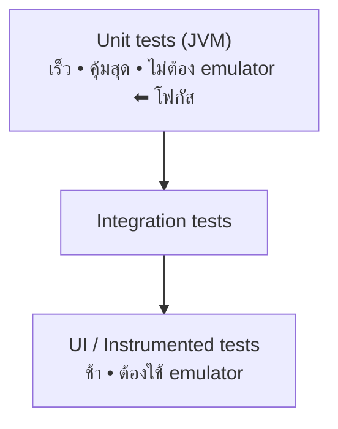
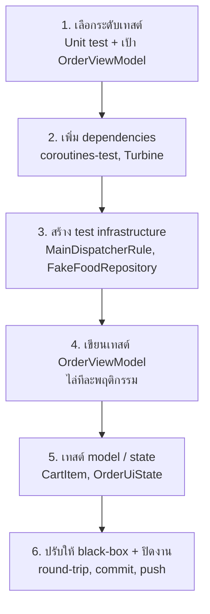
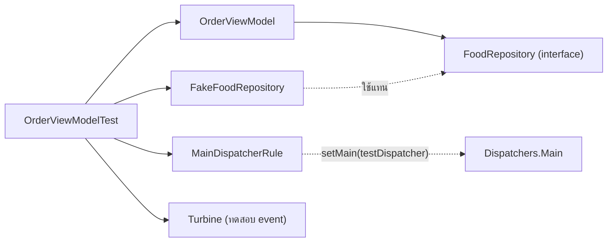
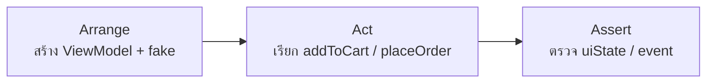
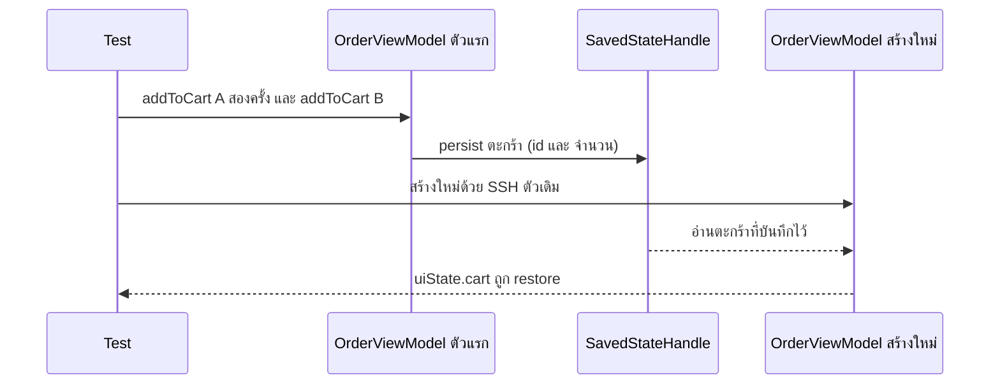

# FoodOrder — แอปสั่งอาหาร (MVVM)

Presentation

1. ภาพรวมของระบบ (คร่าว ๆ)
2. การเขียน Test แบบละเอียด ตั้งแต่ต้นจนจบ (พร้อม diagram)

> วิธีนำเสนอ: ไฟล์นี้แบ่งสไลด์ด้วยเส้น `---` และวาด diagram ด้วย Mermaid
> ดูได้ใน VS Code (Markdown Preview) หรือ GitHub และ export เป็นสไลด์ได้ด้วย
> Marp / reveal.js

---

# ส่วนที่ 1 — ภาพรวมของระบบ

---

## ระบบนี้คืออะไร

- แอป **สั่งอาหารอย่างง่าย** บน Android เขียนด้วย **Kotlin**
- สถาปัตยกรรม **MVVM** ตาม best practice
- หน้าจอ (View) เป็น **XML** + **ViewBinding**
- 2 หน้าจอหลัก: **เมนูอาหาร** และ **ตะกร้าสินค้า**

ความสามารถ
- ดูเมนู, เพิ่มลงตะกร้า, เพิ่ม/ลดจำนวน
- ดูยอดรวม, กดสั่งอาหาร แล้วเคลียร์ตะกร้า

---

## สถาปัตยกรรม MVVM



- **View** แสดงผล + ส่ง event เท่านั้น ไม่มี business logic
- **ViewModel** เป็น single source of truth เปิด state ผ่าน `StateFlow`
- **Repository** ซ่อนที่มาของข้อมูล (สลับเป็น API/DB ได้)

---

## Flow การทำงานของผู้ใช้



---

## Tech stack

| ด้าน | เทคโนโลยี |
|------|-----------|
| ภาษา | Kotlin |
| UI | XML + ViewBinding, Material 3 |
| สถาปัตยกรรม | MVVM (StateFlow + one-shot events) |
| Navigation | Navigation Component (single-activity) |
| Async | Coroutines + Flow |
| State survival | SavedStateHandle (รอด process death) |
| เงิน | BigDecimal (เลี่ยง float error) |
| Build | Gradle Kotlin DSL + Version Catalog |

---

## โครงสร้างแพ็กเกจ

```
com.example.foodorder
├── data
│   ├── model         MenuItem, CartItem
│   ├── source        FoodDataSource
│   └── repository    FoodRepository (+Impl)
├── di                ServiceLocator
└── ui
    ├── MainActivity
    ├── order         OrderViewModel, OrderUiState, OrderEvent
    ├── menu          MenuFragment, MenuAdapter
    └── cart          CartFragment, CartAdapter
```

---

# ส่วนที่ 2 — การเขียน Test (ต้นจนจบ)

---

## ทำไมต้องเทสต์ & เลือกระดับไหน



- เริ่มที่ **Unit test (JVM)** เพราะเร็วและคุ้มที่สุด
- เป้าหมายหลัก: **`OrderViewModel`** (รวม business logic ตะกร้า/ยอดรวม/event)
- เทสต์ได้ง่ายเพราะ MVVM แยก layer และฉีด dependency ผ่าน constructor

---

## ภาพรวม 6 ขั้นตอน



---

## ขั้นที่ 1–2: ตัดสินใจ & เตรียมเครื่องมือ

**1. ตัดสินใจ**
- ระดับ: local unit test (JVM)
- เป้า: `OrderViewModel` + models/state

**2. เพิ่ม dependencies** (`libs.versions.toml` + `build.gradle.kts`)
- `kotlinx-coroutines-test` — คุม coroutine / `viewModelScope`
- `Turbine` — ทดสอบ `Flow` / event ให้เขียนง่าย

---

## ขั้นที่ 3: สร้าง Test Infrastructure



- **`MainDispatcherRule`** — สลับ `Dispatchers.Main` เป็น test dispatcher
  (เพราะ `viewModelScope` รันบน Main ซึ่งไม่มีจริงในเทสต์ JVM)
- **`FakeFoodRepository`** — ใช้ **fake** แทน mock คืนเมนูคงที่ (ITEM_A=55, ITEM_B=50)

---

## ขั้นที่ 4: เขียนเทสต์ OrderViewModel

โครงแต่ละเทสต์แบบ **AAA**



เทคนิคที่ใช้
- `runTest { ... }` + `advanceUntilIdle()` รอ coroutine ทำงาน
- อ่านสถานะจาก `uiState.value`
- ตรวจ event ด้วย **Turbine** (`awaitItem`, `expectNoEvents`)
- เทียบเงิน `BigDecimal` ด้วย `compareTo` (กันปัญหา scale)

---

## ขั้นที่ 4: เคสที่ครอบคลุม (12 เคส)

- โหลดเมนูเข้า `uiState` ตอน init
- สถานะเริ่มต้น: ตะกร้าว่าง / count / total = 0
- `addToCart` เพิ่มจำนวน + อัปเดต count/total
- ยอดรวมของสินค้าหลายชนิด
- `decreaseQuantity` จนเหลือ 0 → รายการหาย
- `decreaseQuantity` ตอน > 1 → ยังอยู่
- `placeOrder` ตะกร้าว่าง → ไม่ยิง event
- `placeOrder` มีของ → ยิง `OrderPlaced` + เคลียร์ตะกร้า
- restore จาก `SavedStateHandle`
- **round-trip** สร้าง ViewModel ใหม่แล้วตะกร้ายังอยู่
- `decreaseQuantity` สินค้าที่ไม่มี → no-op
- คงลำดับการเพิ่มสินค้า (insertion order)

---

## ขั้นที่ 5: เทสต์ระดับ Model / State

- **`CartItemTest`** — `lineTotal = ราคา × จำนวน`
- **`OrderUiStateTest`** — derived values:
  - `cartCount` (ผลรวมจำนวน)
  - `cartTotal` (ผลรวม lineTotal)
  - `isCartEmpty`

เทสต์พวกนี้เป็น pure logic ไม่ต้อง mock ใด ๆ

---

## ขั้นที่ 6: ปรับให้เป็น Black-box (round-trip)

**ก่อน:** เทสต์ persist ไปอ่าน key ภายใน (`"cart_quantities"`) → ผูกกับ implementation

**หลัง:** ทดสอบพฤติกรรมจริงของการ restore



---

## สรุป

- โครงสร้าง MVVM ที่แยก layer ทำให้ **เทสต์ง่ายและเร็ว**
- ครอบคลุมพฤติกรรมหลัก + เคสขอบ รวม **12 เคส** ใน `OrderViewModel`
  และเทสต์ model/state แยกต่างหาก
- ใช้แนวทางมาตรฐาน: **fake แทน mock**, `MainDispatcherRule`, **Turbine**,
  เทสต์ที่พฤติกรรม (black-box)

**ก้าวต่อไป**
- GitHub Actions (CI): รัน build + test + validate Gradle wrapper อัตโนมัติทุก PR
- (ตัวเลือก) ใช้ assertion library เช่น Truth

---

# ขอบคุณครับ / Q&A
